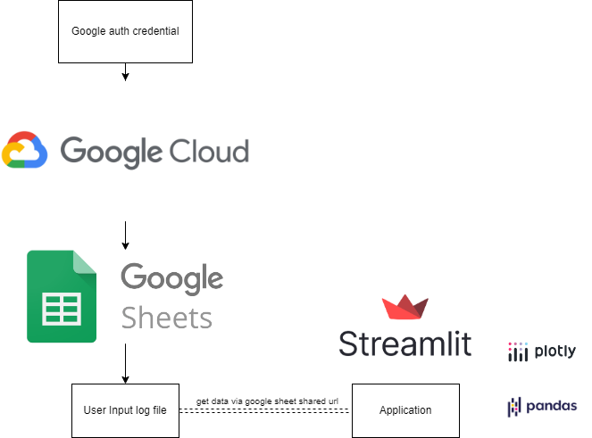

# Expense-Log-Application
This Repository is the repo for keeping my showcase application and source code for simple expense logs where it's connected to Google Sheets via "Google Sheets API" and, using Streamlit framework to visualize the data by selected month and year

